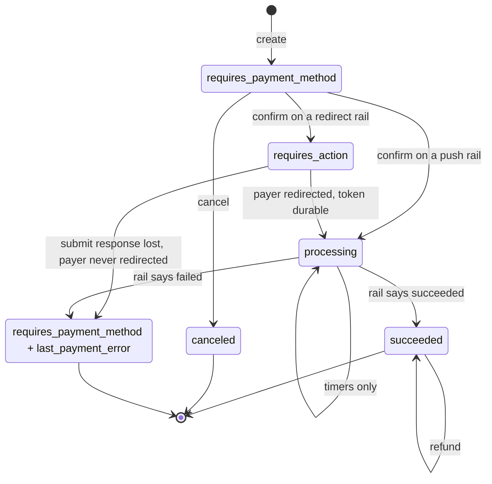

# Payment lifecycle

## Two flow shapes

The MVP rails have genuinely different payer journeys, and the core selects
between them on a **capability value** (`ProviderFlow`), never on a rail name.

| | **push** (MTN MoMo) | **redirect** (Orange Money) |
|---|---|---|
| How the payer acts | Prompt on their handset; they enter a PIN | Browser redirect to the rail's hosted page; they enter an OTP from USSD |
| Who holds the payer identifier | We do — it is an input to submit | The rail does. We may never learn it |
| Submit returns | An acknowledgement, no id | A `pay_token` and a URL to redirect to |
| Status after `confirm` | `processing` | `requires_action` |
| Can the payer act before we persist? | **Yes** | **No** |

That last row is the whole reason `docs/flows/crash-safety.md` has two sections.

## States



## What each transition means

**`confirm` always submits.** `requires_confirmation` is never emitted; it is
absent from the enum rather than present and unreachable.

**`requires_action` is redirect-only.** It carries Stripe's own
`next_action.redirect_to_url` shape, so merchants' existing redirect handling
works unchanged. Push rails never enter this state — there is nothing for a
browser to do while a payer types a PIN into their own handset.

**`processing` leaves only on a terminal answer from the rail.** Timers fire but
assert nothing. This is the crux of the design: a payment that is still pending
at minute 15 can resolve successfully at hour 30, and pretending otherwise is
how you double-charge.

**A rail-reported failure is the only thing that fails a payment.** The intent
returns to `requires_payment_method` with `last_payment_error` populated —
terminal in practice, because only one charge may ever exist per intent.

**`canceled` is reachable only from `requires_payment_method`.** Once a rail has
the request you cannot recall it.

**Refunds do not change intent status.** A refund is a separate object.

## One charge per intent, forever

```sql
CREATE UNIQUE INDEX one_charge_per_intent ON charges (payment_intent_id);
```

A plain unique index, not a partial one. Scoping it to live states leaks: the
moment a charge moves to `failed`, the predicate stops covering it and a second
charge becomes insertable — and "failed" can mean a state we reached *before*
the rail's answer was final.

**Retry means a new PaymentIntent.** This is the one place the API deviates
noticeably from Stripe's ergonomics, and it is deliberate.

## Status

**Updated 2026-09-03 (Step 2).** Types and the flow-selection logic are
implemented and tested in `vpay_core::state`: `Transition`, `next_status`,
and a transition table proven exhaustive over every (status, verb) pair
(`next_status_answers_the_lifecycle_diagram_for_every_pair`,
`the_transition_table_covers_every_status_and_verb`,
`cancel_is_legal_only_from_requires_payment_method`,
`confirm_routes_through_the_flows_own_answer`,
`a_new_intent_starts_where_the_diagram_says`,
`every_state_is_live_or_terminal_exclusively`).

**Two transitions are now driven by real HTTP requests, and neither of them
reaches a rail:**

- **Birth.** `POST /v1/payment_intents` writes a row in
  `requires_payment_method` — the status comes from `IntentStatus::INITIAL`,
  never a literal (`create_then_retrieve_round_trips_through_the_sdk`,
  `backends/tests/integration/tests/payment_intents.rs`).
- **Cancel.** `POST /v1/payment_intents/{id}/cancel` moves
  `requires_payment_method` → `canceled` as a compare-and-swap that also
  refuses when a live charge exists
  (`cancel_is_legal_only_from_requires_payment_method`,
  `a_confirmed_intent_cannot_be_canceled`, and
  `cancel_refuses_an_intent_with_a_live_charge_and_allows_one_with_a_terminal_charge`
  in `backends/crates/vpay-db/tests/repositories.rs`).

**`confirm` does not move the intent at all.** It commits a charge in
`submitting`, records the attempt, calls the adapter, and gets
`ProviderError::NotImplemented` — a `501`
(`confirm_reaches_the_adapter_and_renders_the_documented_501`). The intent
stays `requires_payment_method` on purpose: nothing was submitted, so
claiming `processing` or `requires_action` would be the fabricated success
`CLAUDE.md` names first. **No intent in this repository has ever reached
`processing`, `requires_action` or `succeeded`**, and `last_payment_error`
(columns since migration `0014`) is written by nothing. One charge per
intent is enforced at the API level as well as by the index
(`a_second_confirm_cannot_produce_a_second_charge`). See
[../status.md](../status.md).
