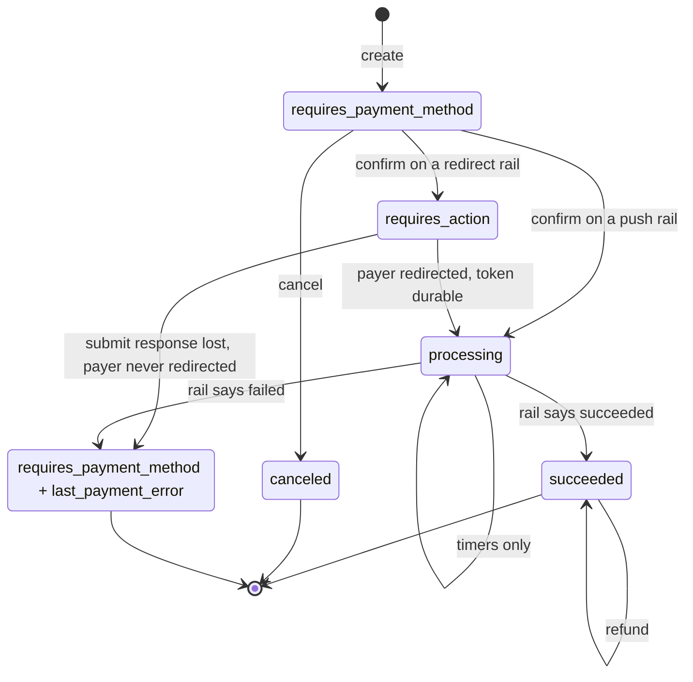

# Payment lifecycle

## Two flow shapes

The MVP rails have genuinely different payer journeys, and the core selects
between them on a **capability value** (`ProviderFlow`), never on a rail name.

| | **push** (MTN MoMo) | **redirect** (Orange Money) |
|---|---|---|
| How the payer acts | Prompt on their handset; they enter a PIN | Browser redirect to the rail's hosted page; they enter an OTP from USSD |
| Who holds the payer identifier | We do — it is an input to submit | The rail does. We may never learn it |
| Submit returns | An acknowledgement, no id | A `pay_token` and a URL to redirect to |
| Status after `confirm` | `processing` | `requires_action` |
| Can the payer act before we persist? | **Yes** | **No** |

That last row is the whole reason `docs/flows/crash-safety.md` has two sections.

## States



## What each transition means

**`confirm` always submits.** `requires_confirmation` is never emitted; it is
absent from the enum rather than present and unreachable.

**`requires_action` is redirect-only.** It carries Stripe's own
`next_action.redirect_to_url` shape, so merchants' existing redirect handling
works unchanged. Push rails never enter this state — there is nothing for a
browser to do while a payer types a PIN into their own handset.

**`processing` leaves only on a terminal answer from the rail.** Timers fire but
assert nothing. This is the crux of the design: a payment that is still pending
at minute 15 can resolve successfully at hour 30, and pretending otherwise is
how you double-charge.

**A rail-reported failure is the only thing that fails a payment.** The intent
returns to `requires_payment_method` with `last_payment_error` populated —
terminal in practice, because only one charge may ever exist per intent.

**`canceled` is reachable only from `requires_payment_method`.** Once a rail has
the request you cannot recall it.

**Refunds do not change intent status.** A refund is a separate object.

## One charge per intent, forever

```sql
CREATE UNIQUE INDEX one_charge_per_intent ON charges (payment_intent_id);
```

A plain unique index, not a partial one. Scoping it to live states leaks: the
moment a charge moves to `failed`, the predicate stops covering it and a second
charge becomes insertable — and "failed" can mean a state we reached *before*
the rail's answer was final.

**Retry means a new PaymentIntent.** This is the one place the API deviates
noticeably from Stripe's ergonomics, and it is deliberate.

## Status

**Updated 2026-09-03 (Step 2).** Types and the flow-selection logic are
implemented and tested in `vpay_core::state`: `Transition`, `next_status`,
and a transition table proven exhaustive over every (status, verb) pair
(`next_status_answers_the_lifecycle_diagram_for_every_pair`,
`the_transition_table_covers_every_status_and_verb`,
`cancel_is_legal_only_from_requires_payment_method`,
`confirm_routes_through_the_flows_own_answer`,
`a_new_intent_starts_where_the_diagram_says`,
`every_state_is_live_or_terminal_exclusively`).

**Two transitions are now driven by real HTTP requests, and neither of them
reaches a rail:**

- **Birth.** `POST /v1/payment_intents` writes a row in
  `requires_payment_method` — the status comes from `IntentStatus::INITIAL`,
  never a literal (`create_then_retrieve_round_trips_through_the_sdk`,
  `backends/tests/integration/tests/payment_intents.rs`).
- **Cancel.** `POST /v1/payment_intents/{id}/cancel` moves
  `requires_payment_method` → `canceled` as a compare-and-swap that also
  refuses when a live charge exists
  (`cancel_is_legal_only_from_requires_payment_method`,
  `a_confirmed_intent_cannot_be_canceled`, and
  `cancel_refuses_an_intent_with_a_live_charge_and_allows_one_with_a_terminal_charge`
  in `backends/crates/vpay-db/tests/repositories.rs`).

**Updated 2026-09-03 (Step 3): `confirm` now moves the intent, because it
now reaches a rail.** It commits a charge in `submitting`, records the
attempt, `await`s `adapter.submit(..)`, and then does one of four things —
which one is decided by the *error's* own classification, never by anything
the handler knows about rails:

- **push rail accepts** → charge `submitted`, intent **`processing`**,
  `200` with `next_action: null`
  (`a_push_confirm_the_rail_accepts_moves_the_intent_to_processing`,
  `backends/tests/integration/tests/confirm_rails.rs`);
- **redirect rail accepts** → charge `submitted` carrying the rail's
  `pay_token` and `redirect_url`, intent **`requires_action`**, `200` with
  `next_action.redirect_to_url`. The rail's material and the merchant's
  `return_url` are committed *before* the response is built, and the
  `next_action` is rendered **only** from the committed charge row
  (`redirect_confirm_commits_the_rails_material_before_it_answers`);
- **the rail declines** (`ProviderError::Rejected`) → charge `failed` with
  its `failure_code`, intent **stays `requires_payment_method`** carrying
  `last_payment_error`, and the merchant gets `409 charge_declined`. The
  lifecycle has no `failed` intent status, and a retry is a new intent
  (`a_payer_the_rail_does_not_know_is_a_decline_the_merchant_can_read`,
  `credentials_the_rail_refuses_are_a_page_and_a_terminal_charge`);
- **anything else** (transport, malformed, misconfiguration) → **nothing
  moves.** The charge stays `submitting` and the attempt stays unanswered,
  because we do not know what the rail did
  (`an_unreachable_rail_leaves_the_charge_where_recovery_expects_it`).

`last_payment_error` (columns since migration `0014`) is written by the
decline path and read back by `GET`. One charge per intent is enforced at
the API level as well as by the index
(`a_second_confirm_cannot_produce_a_second_charge`).

**Updated 2026-09-03 (Step 4): `succeeded` happens, and the worker is what
makes it happen.** A confirmed intent no longer stops at
`processing`/`requires_action`. The `poll_charge` job committed with the charge
drives it to a terminal state:

- **the rail reports the payment** → charge `succeeded` carrying the rail's
  `provider_txn_id` (migration `0021`), intent `succeeded` with
  `amount_received = amount`, and one `payment_intent.succeeded` event — all in
  **one** transaction (`vpay_db::settlement::apply_succeeded`), so there is no
  state in which the intent is paid and the event is missing
  (`a_confirmed_payment_is_driven_to_succeeded_and_the_merchant_sees_it`,
  `backends/tests/integration/tests/worker_e2e.rs`, which drives a real confirm
  through the real loop against a WireMock rail and reads the result back
  through `GET /v1/payment_intents/{id}`);
- **the rail reports a decline after submission** → charge `failed` with its
  `failure_code`/`failure_raw`, intent back to **`requires_payment_method`**
  carrying `last_payment_error`, and one `payment_intent.payment_failed` event,
  in the same single transaction (`apply_failed` →
  `payment_intents::fail_after_submission`). This is the transition this
  document describes and nothing could previously perform: `record_payment_error`
  stamps the error without moving the status, so a sibling writer was added that
  does both in one statement
  (`a_decline_after_submission_returns_the_intent_to_requires_payment_method`).
  A retry is still a new intent — the charge is terminal and
  `one_charge_per_intent` is forever;
- **the rail never answers** → after 24 hours the *charge* moves to
  `unresolved` and a human is alerted, while the **intent stays where it is**.
  `unresolved` is an escalation, not a verdict; the charge is still polled
  hourly and a late success settles it normally
  ([reconciler.md](reconciler.md)).

The settlement's intent guard accepts `processing`, `requires_action` **and**
`requires_payment_method`, because a confirm that crashed before it could move
the intent leaves a live charge against an intent still reading
`requires_payment_method` — see [crash-safety.md](crash-safety.md).

**What still has never happened.** `canceled` after a confirm (cancel is legal
only from `requires_payment_method` and refuses an intent with a live charge —
by design, not by omission); any partial `amount_received`, because neither
rail can collect part of an amount and `ChargeStatus::Succeeded` carries no
amount at all; `prompt_expired_at` and the `payment_intent.processing`
milestone ([reconciler.md](reconciler.md)); and any of this against a **real**
rail — every settlement observed so far came from a WireMock host. See
[../status.md](../status.md).
